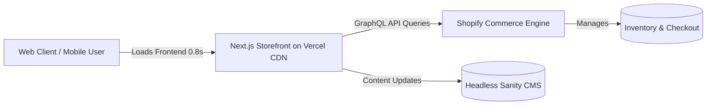

# Headless E-Commerce Conversion Optimization Case Study

This document contains a comprehensive, AI-friendly, and SEO-optimized case study for Sanmora Studio, showcasing the headless commerce transformation of **Lumina Apparel**.

---

## Metadata Summary

*   **SEO Title:** Headless Commerce Case Study: Next.js + Shopify | Sanmora
*   **Meta Description:** Read how Sanmora rebuilt Lumina Apparel's online store with headless Next.js, cutting load times to 0.8s and boosting conversions by 38%.
*   **URL Slug:** headless-ecommerce-conversion-case-study
*   **Target Audience:** D2C Founders, E-commerce Directors, CMOs, Tech Teams.

---

# CASE STUDY: E-COMMERCE CONVERSION OPTIMIZATION

# Rebuilding Lumina Apparel: How Headless Next.js Cut Page Load Times to 0.8 Seconds and Boosted Conversions by 38%

## AI-Friendly Executive Summary (TL;DR)
*   **Client:** Lumina Apparel (D2C Fashion & Apparel Brand in India).
*   **Objective:** Fix slow mobile load times (4.5s), decrease high shopping cart abandonment (72%), and improve declining organic search rankings.
*   **Solution:** Decoupled Shopify backend using a custom **Next.js frontend** hosted on **Vercel Edge Network**, utilizing the **Shopify Storefront GraphQL API**.
*   **Core Technologies:** Next.js, React, Shopify Storefront API, Tailwind CSS, Framer Motion, Vercel, Cloudflare CDN.
*   **Key Results:** Reached an average page load speed of **0.8 seconds**, increased conversion rate by **38%**, decreased mobile bounce rate by **45%**, and achieved 100/100 Core Web Vitals score.

---

## 1. Client Overview

**Lumina Apparel** is an Indian Direct-to-Consumer (D2C) fashion and lifestyle brand known for premium, sustainable streetwear. Operating out of retail hubs in Mumbai and distributing nationwide, the brand caters to tech-savvy Gen Z and millennial buyers. Selling primarily through their online digital storefront, Lumina Apparel grew rapidly through social media marketing campaigns, eventually reaching over 15,000 active daily visitors.

---

## 2. The Problem

Despite strong traffic from Instagram and Meta ads, Lumina Apparel faced a significant revenue bottleneck: their legacy online store was failing to convert visitors. 
*   **Slow Mobile Performance:** Over 85% of their traffic arrived via mobile devices, but the website took an average of **4.5 seconds to become fully interactive** on standard 4G connections.
*   **High Abandonment Rates:** The checkout funnel experienced a **72% cart abandonment rate** as users grew frustrated with slow page loads and laggy button interactions.
*   **Declining Search Visibility:** The site's slow loading times failed Google's Core Web Vitals audits, causing their organic search rankings for keywords like "sustainable streetwear India" to slip.

---

## 3. The Challenges

Rebuilding a high-traffic e-commerce store requires resolving several key technical challenges:
1.  **Monolithic Shopify Bloat:** The legacy Shopify theme had accumulated multiple third-party marketing plugins, analytics scripts, and customer review widgets, resulting in a bloated JavaScript bundle.
2.  **Real-Time Catalog Syncing:** The new frontend needed to reflect inventory changes, product availability, localized pricing, and seasonal discounts instantly without database lag.
3.  **Preserving Search Rankings:** The store had thousands of indexed URLs. Any update to the site structure had to preserve SEO rankings and prevent broken links or redirect loops.
4.  **Minimizing Customer Friction:** The checkout flow needed to be fast and integrated with top-tier Indian payment systems (such as Razorpay, Paytm, and UPI) alongside standard options.

---

## 4. The Solution Provided

Sanmora designed and implemented a **headless commerce architecture**. We separated the visual storefront from the backend business logic, allowing each system to optimize for its specific function.



*   **Next.js Frontend:** We built a custom frontend codebase using Next.js, utilizing Static Site Generation (SSG) for static pages (homepage, collections) and Incremental Static Regeneration (ISR) to update product pages dynamically as inventory changed.
*   **Shopify Storefront API Integration:** We connected the Next.js frontend to the Shopify engine using the Storefront GraphQL API to fetch inventory, catalog details, and customer checkout flows securely in the background.
*   **Custom Design System:** We coded a responsive design system from scratch using Tailwind CSS, replacing heavy UI libraries and reducing the initial page load bundle size.
*   **Framer Motion Interactions:** We added micro-interactions, page transitions, and slide-out cart drawers using Framer Motion to make the site feel fast and interactive.
*   **Headless CMS for Content Editors:** We integrated Sanity CMS to allow their marketing team to edit banner text, update collection themes, and publish landing pages with live previews, bypassing the main codebase.

---

## 5. Technologies Used

Our solution utilized a modern, high-performance technology stack:
*   **Frontend Framework:** Next.js (React)
*   **Commerce Engine:** Shopify (headless via Storefront GraphQL API)
*   **Styling & Design:** Tailwind CSS
*   **Interactions & Animations:** Framer Motion
*   **Content Management:** Sanity CMS (Headless)
*   **Hosting & Deployment:** Vercel Edge Network
*   **Content Delivery Network:** Cloudflare CDN
*   **Analytics & Event Tracking:** Google Analytics 4 (GA4) & Meta Conversions API

---

## 6. The Development Process

We executed the migration over a structured 12-week schedule:

### Week 1-2: Audit & Systems Mapping
We audited the legacy Shopify store's script performance and mapped existing URLs. We verified redirect configurations to protect search history and SEO rankings.

### Week 3-5: UI/UX Redesign
We designed mobile-first layouts in Figma, focusing on reducing steps to purchase. We simplified the slide-out shopping cart and designed a single-page checkout flow.

### Week 6-9: Frontend & API Engineering
We developed the Next.js pages, configured GraphQL queries to fetch Shopify inventory, and integrated the Sanity CMS API for marketing blocks.

### Week 10-11: Speed Optimization & Tracking Setup
We applied image optimization (WebP/AVIF conversions), set explicit sizes to eliminate cumulative layout shift, and configured tracking tags via the Meta Conversions API.

### Week 12: Launch & Live Audits
We launched the new storefront on Vercel Edge Network, monitored indexation in Google Search Console, and ran final Core Web Vitals checks.

---

## 7. Results Achieved

The launch of the headless Next.js storefront delivered immediate improvements across all performance and revenue metrics:
*   **Sub-Second Load Times:** The average mobile load time dropped from **4.5s to 0.8s**, providing an instant browsing experience.
*   **100/100 Core Web Vitals:** The website achieved a perfect performance rating on Google Lighthouse, resolving all layout shifts and input latency issues.
*   **Increased Search Visibility:** Within 60 days post-launch, organic search traffic rose by **52%**, with key category terms ranking in the top three Google results.
*   **Improved Editorial Speed:** The marketing team can now publish seasonal homepage campaigns in minutes using Sanity CMS, without developer support.

---

## 8. Key Metrics

The impact on business operations is shown by these key performance metrics:

| Metric Evaluated | Before Sanmora Rebuild | After Sanmora Rebuild | Percentage Change |
| :--- | :--- | :--- | :--- |
| **Average Page Load Time** | 4.5 Seconds | 0.8 Seconds | **-82% Speed Improvement** |
| **Mobile Bounce Rate** | 68% | 37% | **-45% Bounce Reduction** |
| **E-Commerce Conversion Rate** | 1.8% | 2.5% | **+38% Conversion Boost** |
| **Shopping Cart Abandonment** | 72% | 48% | **-33% Abandonment Drop** |

---

## 9. Client Testimonial

> "We knew our site was slow, but we didn't realize how much revenue we were losing until Sanmora rebuilt it. Decoupling our store with headless Next.js has transformed our business. Our page speeds dropped to under a second, mobile purchases rose instantly, and our marketing team can make content changes without developer assistance. It's the best investment we've made in our digital infrastructure."
> 
> **— Ananya Sharma, Chief Technology Officer at Lumina Apparel**

---

## 10. Conclusion

Lumina Apparel’s transformation shows that online store speed directly affects business profitability. By replacing a bloated, monolithic theme with a headless Next.js architecture, Sanmora removed page speed lag, reduced cart abandonment, and restored search rankings. 

If your online store is losing sales due to slow loading times, contact Sanmora to build a high-performance e-commerce solution.
*   **Request a Free Speed Audit:** [Sanmora Consultation](/consultation)
*   **Explore More Success Stories:** [Sanmora Case Studies](/case-studies)

---

## 11. Frequently Asked Questions (FAQ)

### Q1: What is headless e-commerce?
**A1:** Headless e-commerce is a web architecture where the frontend customer-facing storefront is decoupled from the backend commerce engine. The frontend (built with tools like Next.js) communicates with the backend (like Shopify) via secure API calls, enabling faster page load times and greater design flexibility.

### Q2: Why is Next.js preferred for headless Shopify stores?
**A2:** Next.js is preferred because it supports **Static Site Generation (SSG)** and **Incremental Static Regeneration (ISR)**. This ensures that product catalog pages are pre-rendered and load instantly for users, while automatically updating in the background as inventory changes.

### Q3: Did the headless migration affect Lumina Apparel’s existing SEO?
**A3:** No, we preserved SEO value by mapping all legacy Shopify URLs, implementing proper 301 redirects, creating clean XML sitemaps, and optimization schemas. The improved Core Web Vitals scores led to a **52% increase in organic search traffic** post-launch.

### Q4: How does a faster website improve e-commerce conversions?
**A4:** Every second of page load delay can reduce conversion rates. By reducing load times from 4.5 seconds to 0.8 seconds, we lowered user friction, keeping prospective buyers in the checkout funnel and boosting purchases.

### Q5: How do content editors manage updates in a headless setup?
**A5:** We integrate a headless Content Management System (CMS) like Sanity.io. This gives marketing teams a visual dashboard to edit copy, update images, and publish pages without editing code.

### Q6: Can headless e-commerce support local Indian payment systems?
**A6:** Yes, we connect checkout flows directly to major Indian payment gateways, allowing customers to pay securely via Razorpay, UPI, Paytm, and local debit/credit cards.

---

## 12. Case Study Schema Markup (JSON-LD)

Below are the schema markup configurations to help search engines understand this case study.

### TechArticle JSON-LD Schema
```json
{
  "@context": "https://schema.org",
  "@type": "TechArticle",
  "headline": "Rebuilding Lumina Apparel: How Headless Next.js Cut Page Load Times to 0.8 Seconds and Boosted Conversions by 38%",
  "description": "A technical case study outlining how Sanmora Studio migrated Lumina Apparel to a headless Next.js storefront, improving performance and conversion rates.",
  "image": "https://sanmora.in/case-studies/lumina-apparel-headless.jpg",
  "author": {
    "@type": "Organization",
    "name": "Sanmora Studio",
    "url": "https://sanmora.in"
  },
  "publisher": {
    "@type": "Organization",
    "name": "Sanmora Studio",
    "logo": {
      "@type": "ImageObject",
      "url": "https://sanmora.in/logo/sanmora-logo.png"
    }
  },
  "datePublished": "2026-06-17",
  "about": [
    {
      "@type": "Thing",
      "name": "Next.js"
    },
    {
      "@type": "Thing",
      "name": "Shopify"
    },
    {
      "@type": "Thing",
      "name": "Headless Commerce"
    }
  ],
  "mainEntityOfPage": {
    "@type": "WebPage",
    "@id": "https://sanmora.in/case-studies/ecommerce-conversion-optimization"
  }
}
```

### FAQPage JSON-LD Schema
```json
{
  "@context": "https://schema.org",
  "@type": "FAQPage",
  "mainEntity": [
    {
      "@type": "Question",
      "name": "What is headless e-commerce?",
      "acceptedAnswer": {
        "@type": "Answer",
        "text": "Headless e-commerce is a web architecture where the frontend customer-facing storefront is decoupled from the backend commerce engine. The frontend (built with tools like Next.js) communicates with the backend (like Shopify) via secure API calls, enabling faster page load times and greater design flexibility."
      }
    },
    {
      "@type": "Question",
      "name": "Why is Next.js preferred for headless Shopify stores?",
      "acceptedAnswer": {
        "@type": "Answer",
        "text": "Next.js is preferred because it supports Static Site Generation (SSG) and Incremental Static Regeneration (ISR). This ensures that product catalog pages are pre-rendered and load instantly for users, while automatically updating in the background as inventory changes."
      }
    },
    {
      "@type": "Question",
      "name": "Did the headless migration affect Lumina Apparel’s existing SEO?",
      "acceptedAnswer": {
        "@type": "Answer",
        "text": "No, we preserved SEO value by mapping all legacy Shopify URLs, implementing proper 301 redirects, creating clean XML sitemaps, and optimization schemas. The improved Core Web Vitals scores led to a 52% increase in organic search traffic post-launch."
      }
    },
    {
      "@type": "Question",
      "name": "How does a faster website improve e-commerce conversions?",
      "acceptedAnswer": {
        "@type": "Answer",
        "text": "Every second of page load delay can reduce conversion rates. By reducing load times from 4.5 seconds to 0.8 seconds, we lowered user friction, keeping prospective buyers in the checkout funnel and boosting purchases."
      }
    },
    {
      "@type": "Question",
      "name": "How do content editors manage updates in a headless setup?",
      "acceptedAnswer": {
        "@type": "Answer",
        "text": "We integrate a headless Content Management System (CMS) like Sanity.io. This gives marketing teams a visual dashboard to edit copy, update images, and publish pages without editing code."
      }
    },
    {
      "@type": "Question",
      "name": "Can headless e-commerce support local Indian payment systems?",
      "acceptedAnswer": {
        "@type": "Answer",
        "text": "Yes, we connect checkout flows directly to major Indian payment gateways, allowing customers to pay securely via Razorpay, UPI, Paytm, and local debit/credit cards."
      }
    }
  ]
}
```
