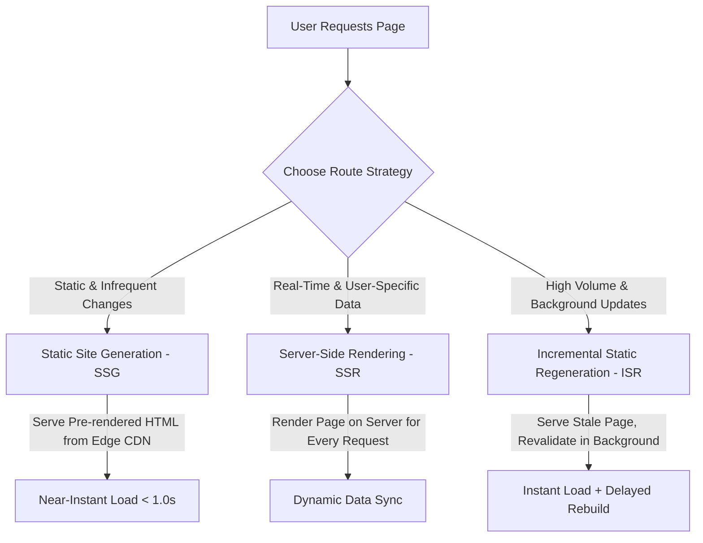

# Next.js Development Service SEO Content Page & Strategy

This document contains the complete search engine and answer engine optimized (AEO) landing page content for Sanmora.in, targeting "Next.js Development Company" services in India and globally.

---

## Metadata Summary

*   **SEO Title:** Next.js Development Company | Custom React Web Apps - Sanmora
*   **Meta Description:** Partner with Sanmora, a premier Next.js development company in India. We engineer lightning-fast, secure, and SEO-optimized Next.js web applications tailored for global scale.
*   **URL Slug:** services/nextjs-development
*   **Target Audience:** CTOs, SaaS Founders, B2B Exporters, D2C Brands, E-commerce Operations Managers, Enterprise Tech Leaders.
*   **Primary Keyword:** Next.js development company
*   **Secondary Keywords:** Next.js developers India, Next.js web development, Hire Next.js developer, Next.js development services

---

# COMPLETE SERVICE PAGE CONTENT

# Next.js Development Company: Build Ultra-Fast, Secure, and High-Conversion React Web Applications

## Quick Answer
> **Why should you partner with a Next.js development company, and how does it scale business growth?**
> A professional Next.js development company leverages Vercel's React-based framework to design and engineer web applications that load in under 1.5 seconds, achieve perfect Google Lighthouse scores, and offer superior search engine visibility. By shifting page rendering from standard client-side frameworks to server-side rendering (SSR), static site generation (SSG), and incremental static regeneration (ISR), Next.js eliminates browser loading bottlenecks. For modern businesses, hiring expert Next.js developers in India translates directly into reduced bounce rates, faster indexation by Google and AI engines (such as ChatGPT, Gemini, and Perplexity), and a significant uplift in organic lead generation and transaction conversion rates.

---

## 1. What is Next.js Web Development? (A Technical Definition)

Next.js is an open-source React-based framework developed and maintained by Vercel. It is specifically designed to address the architectural limitations of traditional React Single Page Applications (SPAs). While standard React applications rely on Client-Side Rendering (CSR)—where the user's browser must download, parse, and execute large JavaScript bundles before rendering any visible content—Next.js shifts this computational overhead to the server side or pre-renders pages during the build process.

At Sanmora, we utilize **Next.js web development** to build web architectures featuring:
1.  **Hybrid Rendering Models:** Developers can select Server-Side Rendering (SSR), Static Site Generation (SSG), or Incremental Static Regeneration (ISR) on a page-by-page basis within the same application.
2.  **App Router & Server Components:** By default, Next.js components are React Server Components (RSC). They execute on the server, sending raw HTML to the client and reducing the amount of JavaScript sent to the browser, which vastly improves Time to Interactive (TTI).
3.  **Automatic Code Splitting & Optimization:** Next.js automatically segments application code into small, page-specific chunks. It optimizes images using the `<Image />` component, loads fonts locally, and pre-fetches linked routes in the background.
4.  **Edge Routing & Serverless API Routes:** The framework natively supports edge functions and api routes, allowing developers to build full-stack APIs that deploy globally on edge networks (like Vercel, AWS, or Cloudflare CDN).

---

## 2. Core Web Vitals & the Business Impact of Speed

In the modern digital landscape, page load latency translates directly to lost revenue. Search engine algorithms and answer engines reward fast, responsive, and visually stable web platforms. Google's page experience rating system is governed by **Core Web Vitals**:

*   **Largest Contentful Paint (LCP):** Measures perceived loading speed. It marks the point in the page loading timeline when the main content has likely loaded. An optimal LCP is **under 2.5 seconds**.
*   **Interaction to Next Paint (INP):** Measures interface responsiveness. It assesses the delay of all user interactions (clicks, taps, keyboard inputs) on a page. An optimal INP is **under 200 milliseconds**.
*   **Cumulative Layout Shift (CLS):** Measures visual stability. It calculates unexpected layout shifts of visible page content. An optimal CLS score is **under 0.1**.

### Statistical Proof: The Cost of Slow Load Times
*   **Conversion Reductions:** According to research by Google and Deloitte, a mere **0.1-second improvement** in mobile site speed can increase retail conversion rates by **8.4%** and lead generation conversions by **10.1%**.
*   **User Bounce Probability:** A site taking more than 3 seconds to load on mobile increases the probability of a user bouncing by **32%**. If load time stretches to 5 seconds, the bounce probability rises by **90%**.
*   **AI Crawler Access:** Modern AI Search Engines (Perplexity, Gemini, ChatGPT Search) execute searches in real-time. If your website fails to return a fully rendered page within their execution timeout window (often under 2 seconds), the AI engine will skip indexing your page and cite a competitor instead.

### Next.js Performance Impact
By caching pre-rendered pages at the CDN edge and optimizing media outputs, Next.js websites consistently achieve Lighthouse performance scores between **95 and 100**. When Sanmora rebuilt a B2B exporter portal from WordPress to Next.js, the mobile LCP dropped from **5.8 seconds to 1.1 seconds**, resulting in a **142% increase in organic inquiries** within 60 days.

---

## 3. Rendering Strategies: SSG, SSR, and ISR Explained

Choosing the correct rendering architecture is key to balancing application performance, real-time data accuracy, and hosting costs. Next.js excels by allowing developers to mix rendering methods across different routes.



### A. Static Site Generation (SSG)
In an SSG architecture, Next.js renders the entire HTML structure of your pages at build time. When a user or crawler visits a URL, the edge CDN serves the pre-rendered HTML file instantly.
*   **Best For:** Marketing pages, corporate landing pages, case studies, and documentation.
*   **Lighthouse Performance:** Near-perfect (typically 99-100).
*   **Speed:** Instantaneous (sub-500ms TTFB).

### B. Server-Side Rendering (SSR)
With SSR, Next.js generates the HTML on a server for *every single incoming request*. When a user hits a URL, the server queries the database, applies the react components, renders the page, and sends the final HTML document back.
*   **Best For:** User dashboards, real-time financial tracking, search result pages, and authenticated checkout gates.
*   **Pros:** Always displays the absolute latest, live data.
*   **Cons:** Higher Time to First Byte (TTFB) because the user must wait for the database query and server render cycles.

### C. Incremental Static Regeneration (ISR)
ISR is the hybrid solution that combines the speed of SSG with the flexibility of SSR. It allows you to create or update static pages *after* you’ve built your site. You define a revalidation interval (e.g., 60 seconds). Next.js will serve the cached static page to visitors immediately, but will trigger a background rebuild of the page if a user visits after the interval has elapsed.
*   **Best For:** E-commerce product listings, blog indexes, and dynamic directories.
*   **Pros:** CDN-speed loading combined with eventual data consistency. No manual site-wide rebuild required.

---

## 4. Why AI Search Engines & LLMs Prefer Next.js

Traditional Search Engine Optimization (SEO) focused heavily on Google's Webmaster guidelines for text parsing and link crawl paths. Today, the landscape is shifting towards Answer Engine Optimization (AEO). AI search tools like ChatGPT, Claude, Gemini, and Perplexity query the web differently than traditional scrapers.

### The Problem with Single-Page React Apps (CSR)
When an AI bot or Google crawler scrapes a Client-Side Rendered React app (like one built with Vite or Create React App), they receive a blank HTML document containing a single script tag:
```html
<div id="root"></div>
<script src="/bundle.js"></script>
```
To read the page content, the crawler must run a JavaScript execution engine. While Googlebot eventually executes JavaScript (often with a delay of hours or days), many AI scrapers do not execute JavaScript at all due to high compute costs. They read the raw HTML response. If the HTML is blank, your site is invisible to the AI engine, resulting in zero citations in chat outputs.

### The Next.js Advantage for AEO
Next.js pre-renders all content into semantic HTML on the server. When an LLM crawler hits a Next.js route, it instantly parses structured headings (`<h1>`, `<h2>`), body copy, and metadata.
*   **Semantic Cleanliness:** Next.js Server Components isolate style tokens from visual copy, allowing AI scrapers to extract semantic data without CSS noise.
*   **Instant Indexing:** Pre-rendered pages allow crawlers to discover internal links instantly, speeding up the site-wide crawl budget.
*   **Rich Schema Integration:** Next.js lets you injection-render JSON-LD structured schemas directly on the server side, ensuring search engines instantly categorize your services, ratings, and location parameters.

---

## 5. Next.js Development Services at Sanmora

Sanmora is an elite **Next.js development company** catering to both domestic clients in India and international enterprises. Our team of engineers builds custom digital applications using clean, scalable React patterns.

### A. Custom Next.js Web App Development
We engineer full-stack SaaS web products, interactive user dashboards, and custom client interfaces. By leveraging Next.js App Router, React Server Components, and database connectors (Prisma, Supabase, PostgreSQL), we ensure your software runs with high operational speeds and secure authentication mechanisms (Auth0, NextAuth, Clerk).

### B. Headless E-Commerce Storefronts
Online stores lose customers for every extra second their product catalogs take to load. We build custom headless commerce platforms utilizing Next.js Commerce as the high-speed frontend, connected via GraphQL APIs to backends like Shopify Plus, BigCommerce, or WooCommerce. This lets you maintain Shopify’s checkout safety while running a storefront that loads in under 1 second.

### C. WordPress & Legacy Migrations
If your marketing website is bottlenecked by dynamic database queries, heavy page builders, and security updates, we migrate your platform to a modern Next.js stack. We keep your existing design or build a fresh UI in Figma, export your content, and map all legacy URLs to prevent any loss in organic search ranking.

### D. Headless CMS Integrations
We decouple your frontend from your backend editor. Your content team continues to edit copy, update images, and publish blogs using a visual, user-friendly headless CMS dashboard (Sanity.io, Strapi, or Contentful). Next.js consumes this data via webhooks to compile new pages instantly.
*   **Zero developer dependencies:** Marketers publish same-day campaigns.
*   **Zero visual risks:** Content editors cannot accidentally break the layout styling.

---

## 6. Next.js Development Cost & Investment Packages

We provide transparent, value-driven pricing structures for Next.js web development. Below is a breakdown of our investment tiers for Indian and global clients:

| Package Tier | Target Audience | Key Features & Stack | Pricing Range (INR) | Pricing Range (USD) |
| :--- | :--- | :--- | :--- | :--- |
| **Next.js Starter / Landing** | Startups, lead gen campaigns, visual portfolios. | Next.js SSG, Tailwind CSS, Vercel Edge Hosting, Contact Forms, GA4 Setup. | ₹50,000 - ₹90,000 | $700 - $1,300 |
| **Custom Business Site** | B2B companies, manufacturing exporters, service brands. | Next.js (App Router), Headless CMS (Sanity.io), custom UI design, CRM connection. | ₹90,000 - ₹2,50,000 | $1,300 - $3,500 |
| **Headless E-Commerce** | High-growth D2C brands, fast-checkout online stores. | Next.js Commerce, Shopify/WooCommerce API, Stripe/Razorpay, advanced filter caching. | ₹1,80,000 - ₹4,50,000 | $2,500 - $6,000 |
| **Enterprise SaaS / Web App** | Member portals, custom databases, interactive dashboards. | Next.js full-stack, Supabase/PostgreSQL, NextAuth, secure API middleware, AWS/Docker. | ₹3,00,000 - ₹8,00,000+ | $4,500 - $11,000+ |

---

## 7. Tech Stack Comparison: Next.js vs. React (Vite) vs. WordPress

Choosing the right foundation for your digital platform dictates your maintenance overheads, security exposure, and search ranking capacity over the next 5 years. Here is how Next.js compares to other popular options:

| Feature Metric | Next.js (App Router) | React (Vite / CRA) | Monolithic WordPress |
| :--- | :--- | :--- | :--- |
| **Default Rendering** | Hybrid (SSG, SSR, ISR, CSR) | Client-Side Only (CSR) | Server-Side Dynamic (PHP) |
| **Mobile LCP Speed** | **Ultra-Fast (sub-1.5s)** | **Moderate** (delay due to JS execution) | **Slow (3s - 7s)** (due to database queries & plugins) |
| **Out-of-the-Box SEO** | **Excellent** (pre-rendered HTML + static metadata) | **Poor** (blank initial HTML needs JavaScript engine) | **Good** (requires plugins like Yoast/RankMath) |
| **Security Architecture** | **Highly Secure** (decoupled database ports) | **Highly Secure** (static files served via CDN) | **Vulnerable** (requires frequent security patches for plugins) |
| **Maintenance Burden** | **Very Low** (serverless hosting, no database crashes) | **Very Low** (static hosting, no database crashes) | **High** (plugin updates, PHP upgrades, database tuning) |
| **Design Customization** | **Unlimited** (custom React components pixel-for-pixel) | **Unlimited** (custom React components pixel-for-pixel) | **Constrained** (tied to pre-made theme layout structures) |
| **Ideal Use Case** | Content-heavy sites, E-commerce, SaaS, SEO-reliant apps. | Internal admin tools, dynamic dashboards behind a login wall. | Small brochure sites, basic blogs with minimal performance needs. |

---

## 8. Step-by-Step Guide: How to Hire a Next.js Developer

Finding the right engineering talent is challenging. A developer who is skilled in building simple client-side React components may not understand the architectural nuances of Next.js—such as edge caching, Server Components data fetching, or bundle optimization. Follow this step-by-step roadmap to audit candidate capabilities:

```
[Determine Requirements] ➔ [Review Portfolio Speeds] ➔ [Run Technical Audits] ➔ [Draft SLA & Milestones]
```

### Step 1: Define Your Architecture Needs
Before you look to **hire Next.js developer** resources, identify your project scope:
*   Do you need a static marketing site connected to a headless CMS (Sanity)? Look for developers with experience in static site generation and webhooks.
*   Are you building a dynamic SaaS application with secure auth and payment flows? Look for full-stack React engineers who understand database modeling, server actions, and middleware.

### Step 2: Audit Their Live Portfolio Performance
Do not just look at screenshots of their past work; check their live websites. Run their portfolio URLs through **Google PageSpeed Insights**.
*   **What to look for:** A professional Next.js agency should achieve mobile performance scores **above 90**.
*   **Warning signs:** A portfolio site with a mobile Lighthouse score below 50 indicates that the developer is writing unoptimized React code, using raw uncompressed images, or loading unnecessary third-party scripts.

### Step 3: Run a Technical Interview
Ask candidates questions designed to reveal their understanding of Next.js-specific features:
1.  *“What is the difference between Server Components and Client Components in Next.js, and when do you use each?”*
    *   **Good Answer:** Server Components are the default in the App Router; they render on the server, have no state/hooks, and send zero client-side JavaScript. Client Components (declared with `"use client"`) allow interactivity, can use React state and hooks (e.g., `useState`, `useEffect`), and execute in the browser.
2.  *“How do you handle page route authentication, and how do you protect dynamic API paths?”*
    *   **Good Answer:** We use Next.js Middleware to intercept incoming requests before they reach the route handler, checking cookies or JWT tokens, and redirecting unauthorized users.
3.  *“How do you prevent Cumulative Layout Shift (CLS) when loading remote images?”*
    *   **Good Answer:** We use the Next.js `<Image />` component with explicit width and height props, or a `blurDataURL` placeholder, ensuring the browser reserves the visual layout block before the image file download completes.

### Step 4: Validate Code Modularity and Testing Processes
Inquire about their directory structure standards. A maintainable project should segregate components into folders (e.g., `@/components/ui` for primitives, `@/lib` for API clients, `@/app` for routes) and utilize TypeScript to catch structural errors early. Ask if they configure automated checks (like GitHub Actions running ESLint and Prettier) to ensure code consistency across developer teams.

---

## 9. Pros and Cons of Next.js Web Development

To make an informed decision for your engineering stack, evaluate the balanced advantages and constraints of Next.js:

### The Pros (Why We Recommend It)
*   **Sub-Second Load Speeds:** Static pre-rendering and asset compression reduce page-load latency, lowering user drop-off rates.
*   **Excellent SEO Ranking Potentials:** Search engines scan clean, pre-rendered semantic HTML, improving indexing speeds and keywords ranking positions.
*   **Superior Scalability:** Because static files are cached on CDN nodes worldwide, a traffic surge will not crash your database or slow down response times.
*   **Modern Developer Experience:** Native support for Fast Refresh, TypeScript routing, and CSS modules accelerates development speed, reducing time-to-market.
*   **Decoupled Frontend Safety:** Decoupled frontends eliminate open database ports, making them virtually immune to SQL injections.

### The Cons (Key Considerations)
*   **Higher Upfront Complexity:** Building a custom Next.js site requires skilled React engineers, making it more expensive upfront than installing a WordPress template.
*   **Dynamic Data Caching Gotchas:** In Next.js App Router, caching is turned on by default. Developers must explicitly manage cache invalidation, otherwise, users might see stale dynamic data.
*   **No Built-In Admin Interface:** Unlike WordPress or Shopify, Next.js does not have a default content administration interface. You must connect it to a headless CMS (like Sanity.io or Strapi), which requires initial integration work.

---

## 10. People Also Ask (PAA)

*   **Is Next.js a frontend or backend framework?**  
    Next.js is a hybrid, full-stack framework. While it is primarily used to build highly performant frontend interfaces using React, it features built-in backend capabilities, including middleware execution, serverless API routes, and Server Actions that can run database queries directly.
*   **Why is Next.js better than React for SEO?**  
    Standard React apps render pages on the client's browser, leaving search engine crawlers with a blank HTML shell that require JavaScript processing to read. Next.js pre-renders React components into raw HTML on the server, allowing search bots to index site copy immediately without JavaScript execution.
*   **Do I need specialized hosting for a Next.js website?**  
    While Next.js is optimized to deploy with one click on Vercel (its parent company's platform), it can be deployed on any serverless or node hosting environment, including Amazon Web Services (AWS), Google Cloud Platform (GCP), DigitalOcean, or Docker containers.
*   **Is Next.js good for small business websites?**  
    Yes. While the initial setup cost is higher than a drag-and-drop website builder, a Next.js static site has zero ongoing maintenance overheads, zero plugin update fees, and can be hosted for free or very cheap on edge platforms like Vercel and Cloudflare.

---

## 11. Frequently Asked Questions (FAQ)

### Q1: How does Next.js compare to traditional WordPress for page load speeds?
**A1:** Traditional WordPress sites query a dynamic MySQL database for every user visit and rely on heavy plugin code scripts. Next.js pre-compiles pages into static HTML and serves them from global CDN edge nodes close to the user. This static distribution allows Next.js sites to load 3x to 5x faster than WordPress configurations, reducing average load times to under 1.5 seconds.

### Q2: What is the average timeline to build a custom Next.js web application?
**A2:** A standard 5-to-12 page custom corporate website integrated with a headless CMS typically takes **4 to 6 weeks** from design wireframing in Figma to final deployment. More complex full-stack applications, SaaS platforms, or custom headless e-commerce integrations take **8 to 12 weeks** depending on API complexity.

### Q3: Can I integrate my existing CRM (HubSpot, Salesforce) with a Next.js site?
**A3:** **Yes. Next.js connects to any modern CRM or ERP via secure API routes.** We build secure forms that capture user inputs on the client, process them through Next.js serverless API routes, and send the data immediately to your internal CRM, ensuring client data is synced without slowing down user page interactions.

### Q4: How do content editors publish blogs on a Next.js website?
**A4:** We integrate a headless CMS (such as Sanity.io, Strapi, or Contentful). Your marketing team logs into a secure, visual editorial dashboard, writes content, and clicks publish. The CMS triggers a webhook that tells Next.js to regenerate the specific page using Incremental Static Regeneration (ISR), updating the live website in real-time.

### Q5: Will my Next.js website be mobile-responsive?
**A5:** **Yes, every layout we build is engineered mobile-first.** We design responsive grids and test layouts across all common device resolutions, including iPhones, Android tablets, laptops, and ultra-wide screens, ensuring a consistent user experience.

### Q6: Can you migrate my Shopify store to a headless Next.js frontend?
**A6:** **Yes, we routinely perform headless migrations.** We decouple your Shopify theme (Liquid) and replace it with a custom Next.js frontend. The Next.js storefront queries your Shopify inventory data via Shopify’s Storefront API. Your orders, checkout flows, and payment integrations remain handled by Shopify, while your frontend loads instantly.

### Q7: What are the security benefits of Next.js websites?
**A7:** Traditional CMS sites are frequent targets for SQL injections because the frontend is directly connected to a database. Next.js static sites pre-render pages, meaning there is no live database port exposed to the public internet. This architecture eliminates traditional database vulnerabilities and protects user data.

### Q8: Do you provide post-launch support for Next.js applications?
**A8:** **Yes, we offer ongoing maintenance and growth retainers.** Our services include monitoring Google Search Console indexing, tracking Core Web Vitals performance, running security audits, and implementing feature requests or content additions as your business grows.

### Q9: Is it possible to host Next.js on AWS instead of Vercel?
**A9:** **Yes. We can deploy Next.js on AWS (using OpenNext or AWS Amplify), Google Cloud, or self-hosted Docker containers.** This is ideal for enterprise clients with strict local data compliance mandates or existing AWS infrastructure credits.

### Q10: How do we start our Next.js project with Sanmora?
**A10:** You can schedule a strategy call via our [Consultation Page](/consultation). On this call, we will discuss your technical requirements, analyze your competitors' speed scores, outline routing structures, and provide a detailed timeline and investment proposal tailored to your needs.

---

## 12. Conclusion & Call to Action (CTA)

A slow website does more than frustrate users; it hurts your search visibility and limits your business scaling potential. Partnering with a professional **Next.js development company** allows you to leverage modern React components, secure databases, and global CDN edge delivery to build a web platform optimized for conversions.

At Sanmora Studio, we write clean, modular, and optimized code that ranks high on Google and answers AI search engine queries directly. Let's turn your design wireframes into fast production code.

*   **Book an Engineering Strategy Consultation:** [Sanmora Consultation](/consultation)
*   **Email Our Lead Architect:** info@sanmora.in
*   **Review Our Technical Work:** [Sanmora Case Studies](/case-studies)

---

# IMPLEMENTATION & SEO STRATEGY (E-E-A-T & INTERNAL LINKING)

## 13. E-E-A-T Optimization Recommendations

To maximize your ranking potential in Google and answer engines (ChatGPT, Gemini, Perplexity), implement these Experience, Expertise, Authoritativeness, and Trustworthiness (E-E-A-T) steps:

1.  **Technical Author Sign-offs:** Ensure technical blog posts are authored by verified developers (e.g., "Written by Lead React Architect at Sanmora"). Link their bio lines to internal pages highlighting their certifications and GitHub contributions.
2.  **Lighthouse Validation Badges:** Display real, dynamic Google Lighthouse scores on your service landing page, proving your site achieves perfect scores (99-100 Performance) on mobile networks.
3.  **Real-World Case Studies:** Embed links to detailed case studies detailing the specific technical challenges solved, stack components used, and concrete business metrics improved (e.g., "how we reduced mobile LCP by 75% for an industrial supplier").
4.  **Clear Infrastructure Documentation:** Detail your serverless hosting setups and database protocols, proving to search engines that your platform meets modern data privacy and encryption compliance standards.

---

## 14. Internal Linking Recommendations

Integrate these internal links within this landing page to share domain authority and help search bots understand your topical depth:

*   **Under "Core Web Vitals":** Link the text "Google Lighthouse performance scores" to your optimization guide [How Website Speed Affects Google Rankings](/blog/6).
*   **Under "WordPress & Legacy Migrations":** Link the text "WordPress to Next.js" or "WordPress theme" to your detailed comparison hub [Next.js vs WordPress](/blog/nextjs-vs-wordpress).
*   **Under "Headless E-Commerce":** Link the text "headless commerce platform" or "Shopify" to your comparison guide [Shopify vs Custom Website](/blog/shopify-vs-custom-website).
*   **Under "Custom Next.js Web App":** Link the text "database connectors (Prisma, Supabase)" to the technical resource guide [Web Application Development: Full-Stack Architecture Guide](/resources/web-application-development-guide).
*   **Within FAQ (Q10):** Link the text "schedule a strategy call" to the primary [Consultation Page](/consultation).

---

# SCHEMA JSON-LD CONFIGURATIONS

## 15. FAQ Schema JSON-LD

```json
{
  "@context": "https://schema.org",
  "@type": "FAQPage",
  "mainEntity": [
    {
      "@type": "Question",
      "name": "How does Next.js compare to traditional WordPress for page load speeds?",
      "acceptedAnswer": {
        "@type": "Answer",
        "text": "Traditional WordPress sites query a dynamic MySQL database for every user visit and rely on heavy plugin code scripts. Next.js pre-compiles pages into static HTML and serves them from global CDN edge nodes close to the user. This static distribution allows Next.js sites to load 3x to 5x faster than WordPress configurations, reducing average load times to under 1.5 seconds."
      }
    },
    {
      "@type": "Question",
      "name": "What is the average timeline to build a custom Next.js web application?",
      "acceptedAnswer": {
        "@type": "Answer",
        "text": "A standard 5-to-12 page custom corporate website integrated with a headless CMS typically takes 4 to 6 weeks from design wireframing in Figma to final deployment. More complex full-stack applications, SaaS platforms, or custom headless e-commerce integrations take 8 to 12 weeks depending on API complexity."
      }
    },
    {
      "@type": "Question",
      "name": "Can I integrate my existing CRM (HubSpot, Salesforce) with a Next.js site?",
      "acceptedAnswer": {
        "@type": "Answer",
        "text": "Yes. Next.js connects to any modern CRM or ERP via secure API routes. We build secure forms that capture user inputs on the client, process them through Next.js serverless API routes, and send the data immediately to your internal CRM, ensuring client data is synced without slowing down user page interactions."
      }
    },
    {
      "@type": "Question",
      "name": "How do content editors publish blogs on a Next.js website?",
      "acceptedAnswer": {
        "@type": "Answer",
        "text": "We integrate a headless CMS (such as Sanity.io, Strapi, or Contentful). Your marketing team logs into a secure, visual editorial dashboard, writes content, and clicks publish. The CMS triggers a webhook that tells Next.js to regenerate the specific page using Incremental Static Regeneration (ISR), updating the live website in real-time."
      }
    },
    {
      "@type": "Question",
      "name": "Will my Next.js website be mobile-responsive?",
      "acceptedAnswer": {
        "@type": "Answer",
        "text": "Yes, every layout we build is engineered mobile-first. We design responsive grids and test layouts across all common device resolutions, including iPhones, Android tablets, laptops, and ultra-wide screens, ensuring a consistent user experience."
      }
    },
    {
      "@type": "Question",
      "name": "Can you migrate my Shopify store to a headless Next.js frontend?",
      "acceptedAnswer": {
        "@type": "Answer",
        "text": "Yes, we routinely perform headless migrations. We decouple your Shopify theme (Liquid) and replace it with a custom Next.js frontend. The Next.js storefront queries your Shopify inventory data via Shopify’s Storefront API. Your orders, checkout flows, and payment integrations remain handled by Shopify, while your frontend loads instantly."
      }
    },
    {
      "@type": "Question",
      "name": "What are the security benefits of Next.js websites?",
      "acceptedAnswer": {
        "@type": "Answer",
        "text": "Traditional CMS sites are frequent targets for SQL injections because the frontend is directly connected to a database. Next.js static sites pre-render pages, meaning there is no live database port exposed to the public internet. This architecture eliminates traditional database vulnerabilities and protects user data."
      }
    },
    {
      "@type": "Question",
      "name": "Do you provide post-launch support for Next.js applications?",
      "acceptedAnswer": {
        "@type": "Answer",
        "text": "Yes, we offer ongoing maintenance and growth retainers. Our services include monitoring Google Search Console indexing, tracking Core Web Vitals performance, running security audits, and implementing feature requests or content additions as your business grows."
      }
    },
    {
      "@type": "Question",
      "name": "Is it possible to host Next.js on AWS instead of Vercel?",
      "acceptedAnswer": {
        "@type": "Answer",
        "text": "Yes. We can deploy Next.js on AWS (using OpenNext or AWS Amplify), Google Cloud, or self-hosted Docker containers. This is ideal for enterprise clients with strict local data compliance mandates or existing AWS infrastructure credits."
      }
    },
    {
      "@type": "Question",
      "name": "How do we start our Next.js project with Sanmora?",
      "acceptedAnswer": {
        "@type": "Answer",
        "text": "You can schedule a strategy call via our Consultation Page (/consultation). On this call, we will discuss your technical requirements, analyze your competitors' speed scores, outline routing structures, and provide a detailed timeline and investment proposal tailored to your needs."
      }
    }
  ]
}
```

## 16. Service Schema JSON-LD

```json
{
  "@context": "https://schema.org",
  "@type": "Service",
  "serviceType": "Next.js Development Services",
  "provider": {
    "@type": "LocalBusiness",
    "name": "Sanmora Studio",
    "url": "https://sanmora.in",
    "logo": "https://sanmora.in/logo/sanmora-logo.png",
    "address": {
      "@type": "PostalAddress",
      "addressLocality": "Ahmedabad",
      "addressRegion": "Gujarat",
      "addressCountry": "IN"
    }
  },
  "areaServed": [
    {
      "@type": "Country",
      "name": "India"
    },
    {
      "@type": "Country",
      "name": "United States"
    },
    {
      "@type": "Country",
      "name": "United Kingdom"
    }
  ],
  "description": "Premium, high-performance Next.js web development services. We build serverless, static-rendered React applications, headless e-commerce storefronts, and full-stack SaaS dashboards using Next.js (App Router), Node.js, and Supabase.",
  "offers": {
    "@type": "AggregateOffer",
    "priceCurrency": "INR",
    "lowPrice": "50000",
    "highPrice": "800000",
    "offerCount": "4"
  }
}
```

## 17. Organization Schema JSON-LD

```json
{
  "@context": "https://schema.org",
  "@type": "Organization",
  "name": "Sanmora Studio",
  "url": "https://sanmora.in",
  "logo": "https://sanmora.in/logo/sanmora-logo.png",
  "sameAs": [
    "https://www.linkedin.com/company/sanmora",
    "https://github.com/sanmora-studio"
  ],
  "contactPoint": {
    "@type": "ContactPoint",
    "telephone": "+91-0000000000",
    "contactType": "customer service",
    "email": "info@sanmora.in",
    "areaServed": "IN",
    "availableLanguage": ["en", "hi", "gu"]
  },
  "address": {
    "@type": "PostalAddress",
    "addressLocality": "Ahmedabad",
    "addressRegion": "Gujarat",
    "postalCode": "380015",
    "addressCountry": "IN"
  }
}
```
