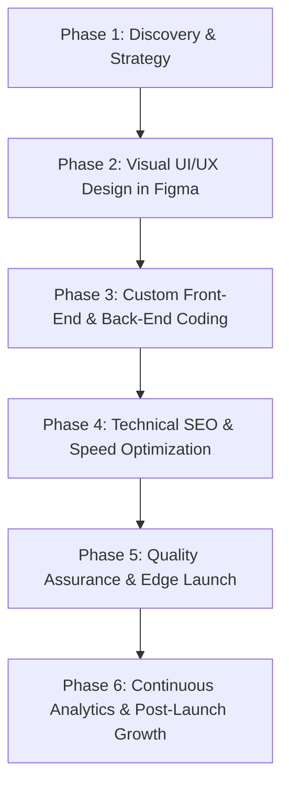

# Website Development Service SEO Content Page & Strategy

This document contains the complete search engine and answer engine optimized (AEO) landing page content for Sanmora.in, targeting "Website Development" services in India and globally.

---

## Metadata Summary

*   **SEO Title:** Website Development Services in India | Sanmora Studio
*   **Meta Description:** Scale your business with Sanmora's premium website development services. We build fast, secure, and SEO-optimized Next.js and custom web apps.
*   **URL Slug:** website-development
*   **Target Audience:** Indian & Global Businesses, B2B Manufacturers, D2C Brands, SaaS Founders, Tech Startups.

---

# COMPLETE ARTICLE & LANDING PAGE CONTENT

# Website Development Services in India: Build Fast, Secure, and High-Conversion Custom Web Solutions

## Quick Answer
> **What is professional website development, and how does it drive business growth?** 
> Professional website development is the engineering of custom, high-speed, and secure web applications tailored to specific business goals. Unlike generic templates, professional development uses clean code and modern frameworks (like Next.js and React) to ensure fast loading speeds (under 1.5 seconds), mobile responsiveness, and high conversion rates. For modern businesses, an optimized website serves as the primary engine for organic lead generation, customer acquisition, and search engine visibility, directly increasing revenue by turning traffic into paying customers.

---

## 1. What is Modern Website Development? (A Short Definition)

Modern website development has evolved far beyond basic HTML pages or standard drag-and-drop templates. Today, website development is the strategic process of writing clean, semantic, and highly performant code to build visual digital interfaces that run on browsers. It encompasses everything from front-end user experience (UX) layout design to back-end server operations, database architecture, API integrations, and technical Search Engine Optimization (SEO).

At Sanmora, we categorize modern web development into four main delivery formats:
1.  **Static Websites (Jamstack / SSG):** High-speed, pre-rendered marketing pages that load instantly and offer bulletproof security because they do not rely on an active database query during a user visit.
2.  **Dynamic Websites (SSR / Full-Stack):** Data-driven applications featuring secure authentication systems, databases, real-time client dashboards, and custom admin workflows.
3.  **Headless E-Commerce Frontends:** Custom online stores built to display catalogs instantly, utilizing payment gateway integrations (Razorpay, Stripe) and headless architectures to support heavy traffic spikes without slowing down.
4.  **Custom CMS Configurations:** Content architectures that separate the editorial dashboard (like Sanity, Strapi, or headless WordPress) from the frontend website, allowing marketing teams to publish campaigns without developer bottlenecks.

---

## 2. Core Benefits of Professional Website Development

Investing in custom, professionally engineered website development provides compounding benefits that pre-built templates simply cannot match. Here is why high-growth brands select custom development:

### A. Exceptional Core Web Vitals and Search Engine Rankings
Google's ranking algorithms prioritize page experience. Core Web Vitals—specifically Largest Contentful Paint (LCP), Interaction to Next Paint (INP), and Cumulative Layout Shift (CLS)—measure how fast and stable a webpage feels to a real user. Custom websites built on Next.js achieve perfect Google Lighthouse scores because they eliminate bloated CSS, unused JavaScript, and database query lag. This high technical efficiency ensures higher search visibility, lower crawl budgets, and immediate indexing of new content.

### B. Bulletproof Security and Zero Server Maintenance
Standard Content Management Systems (CMS) like traditional self-hosted WordPress require continuous plugin updates and are frequent targets for SQL injections and cross-site scripting (XSS) attacks. By utilizing static site generation (SSG) and serverless hosting on edge networks (like Vercel and Cloudflare CDN), custom websites eliminate the traditional database attack vectors. This results in virtually zero downtime, zero server maintenance costs, and absolute security for customer data.

### C. Unlimited Customization and Design Freedom
Pre-made templates restrict your brand to layouts designed for hundreds of other companies. Professional web development gives you absolute design flexibility. Using tools like Figma for UI/UX and Framer Motion for interactive micro-animations, developers can render complex workflows, interactive pricing models, and immersive visual storytelling that matches your brand identity exactly.

### D. Headless CMS Flexibility for Marketing Agility
A custom frontend does not mean you lose the ability to edit content. By integrating a headless CMS (like Sanity, Contentful, or Strapi), we build customized administration screens tailored to your marketing workflows. Editors can edit copy, update images, and publish blogs in real-time with instant live previews, with zero risk of accidentally breaking code layouts.

---

## 3. The Sanmora Website Development Process & Workflow

We do not just write code; we design and execute a structured, transparent engineering pipeline that ensures projects are delivered on time and fully optimized for conversions.



### Phase 1: Discovery, Architecture, and SEO Mapping
We start by understanding your business model, target audience, and direct competitors. We conduct keyword research to map out a clear URL hierarchy and content layout plan, ensuring the site structure matches real search intent from day one.

### Phase 2: UI/UX Wireframing and Visual Prototyping
Our design team builds high-fidelity prototypes in Figma. We focus on clean layouts, typography scales, accessibility compliance (WCAG), and responsive screens. You review and approve the exact interactive look and feel before we write a single line of code.

### Phase 3: Agile Engineering (Coding)
Using Next.js, React, Node.js, and modern styling tokens, we write clean, modular, and reusable code. We build robust API endpoints, secure user databases, and integrate third-party platforms (CRMs, ERPs, and marketing automation tools).

### Phase 4: Speed Tuning and Core Web Vitals Audits
We optimize all media assets by converting images to WebP/AVIF formats, setting explicit sizes to prevent layout shifts, and implementing lazy-loading. We configure server-side rendering (SSR) or static rendering (SSG) to ensure the site loads in under 1.5 seconds on mobile networks in India.

### Phase 5: Comprehensive QA Testing & Deployment
We test the website across all major browsers (Chrome, Safari, Firefox, Edge) and device aspect ratios. Once certified, we deploy the site to global edge networks (Vercel, AWS, or Cloudflare CDN), achieving maximum availability and zero latency.

### Phase 6: Post-Launch Growth and Optimization
After launch, we monitor search indexation via Google Search Console and user behavior via Google Analytics 4 (GA4). We set up tracking parameters to help you observe conversions, identify friction points, and continuously update content clusters.

---

## 4. Website Development Pricing & Investment Tiers

We believe in transparent, value-based pricing. Below is an overview of our service packages structured for businesses in India and global clients:

| Package Tier | Best For | Technical Stack | Pricing Range (INR) | Pricing Range (USD) |
| :--- | :--- | :--- | :--- | :--- |
| **Starter / Landing Page** | Startups, lead gen campaigns, simple portfolio sites. | HTML5, CSS3, JS, Next.js SSG, Cloudflare CDN. | ₹40,000 - ₹80,000 | $600 - $1,200 |
| **Custom Business Site** | B2B companies, manufacturing exporters, service brands. | Next.js, headless CMS (Sanity), Tailwind CSS. | ₹80,000 - ₹2,00,000 | $1,200 - $3,000 |
| **Dynamic Platform / SaaS** | Member portals, custom databases, interactive web apps. | React, Node.js, PostgreSQL, Prisma, AWS. | ₹2,00,000 - ₹5,00,000+ | $3,000 - $7,500+ |
| **Headless E-Commerce Store** | D2C retail brands, multi-category catalogs, fast checkouts. | Next.js Commerce, Shopify API, Stripe/Razorpay. | ₹1,50,000 - ₹4,00,000 | $2,200 - $6,000 |

---

## 5. Website Development Use Cases & Business Applications

Different businesses require different engineering approaches. Here are the core use cases we address:

### A. Custom SaaS Platforms
For tech startups, we build secure, multi-tenant software-as-a-service (SaaS) web platforms. This includes building secure user databases, subscription management via Stripe, customized user roles, search features, and interactive dashboards.

### B. High-Growth B2B Manufacturing Portals
In industrial hubs like Ahmedabad and across Gujarat (GIDC), B2B manufacturers need portals to display complex machinery catalogs and capture international import/export inquiries. We build highly structured search architectures and fast inquiry forms that feed directly into internal CRMs.

### C. D2C E-Commerce & Retail Stores
Online retailers lose customers with every extra second their site takes to load. We build custom headless e-commerce storefronts that display thousands of products instantly, offering seamless filters, secure checkout pages, and tracking events that reduce cart abandonment.

### D. Corporate Websites for Global Consulting & Services
For professional consultancies, visual aesthetics and authority are critical. We design clean corporate websites that highlight past case studies, display client testimonials, and feature automated booking forms to schedule consultation calls.

---

## 6. Comparison: Next.js vs. Traditional WordPress

Choosing the right technology stack is the most important decision for your digital infrastructure. Here is how our modern stack compares to traditional setups:

| Evaluation Metric | Sanmora Next.js / React Stack | Traditional Monolithic WordPress |
| :--- | :--- | :--- |
| **Mobile Loading Speed** | **Ultra-Fast (Under 1.5s)** – Static assets served from close CDNs. | **Slow (3s - 8s)** – Heavy database queries and plugin overhead. |
| **Security Risk** | **Virtually Zero** – No public database connection or plugin vulnerabilities. | **High** – Requires active maintenance to prevent hacks. |
| **SEO Indexation** | **Excellent** – Clean HTML structure and fast crawl speeds. | **Moderate** – Prone to code bloat and indexing delays. |
| **Design Flexibility** | **Unconstrained** – Custom coded layouts pixel-for-pixel. | **Restricted** – Constrained by pre-built theme code rules. |
| **Maintenance Overheads** | **None** – No plugins or themes to update weekly. | **High** – Risk of sites breaking during updates. |

---

## 7. People Also Ask (PAA)

*   **How much does a website cost in India?**  
    A basic static website for a small business in India typically costs between ₹30,000 to ₹70,000. For custom development using modern frameworks like Next.js with content management integration, pricing ranges from ₹80,000 to ₹2,500,000 depending on database complexity, customization level, and API integrations.
*   **What is the difference between web design and web development?**  
    Web design focuses on the visual graphics, layout grids, usability (UI/UX), and color psychology of a site, typically created in Figma. Web development is the process of translating those designs into clean, functional code (HTML, JavaScript, React) that runs smoothly in browsers.
*   **Why is Next.js better than WordPress for SEO?**  
    Next.js provides clean HTML markups, automatic image optimization, faster server-side response times, and near-instant load speeds. These metrics improve your Google Core Web Vitals, which is a major search engine ranking factor. WordPress sites often suffer from slow server execution and database bloat.
*   **How long does it take to develop a custom website?**  
    A standard 5-to-10 page custom business website takes approximately 4 to 6 weeks from strategy to deployment. More complex dynamic applications, SaaS portals, or large headless e-commerce stores can take 8 to 12 weeks of engineering time.

---

## 8. Frequently Asked Questions (FAQ)

### Q1: What technology stack does Sanmora use for website development?
**A1:** At Sanmora Studio, we primarily build websites using **Next.js, React.js, Tailwind CSS, and Framer Motion** for the frontend. For backend services and database management, we utilize **Node.js, PostgreSQL, Supabase, Prisma ORM, and Docker**, deploying projects to edge platforms like **Vercel, AWS, and Cloudflare**. This modern stack ensures fast page performance, high security, and clean database structures.

### Q2: Will my website be mobile-friendly and optimized for different screens?
**A2:** **Yes, every website we build features responsive design built mobile-first.** We test all layout grids, navigation menus, and media files across different resolutions, including smartphones, tablets, laptops, and ultra-wide desktop monitors, ensuring a consistent user experience.

### Q3: Can my marketing team edit content without code after launch?
**A3:** **Yes, we integrate user-friendly headless Content Management Systems (CMS) like Sanity.io or Strapi.** This allows your marketing team to edit copy, publish blog posts, add product categories, and manage landing pages using a secure visual editor. These updates update the live website automatically without altering the core codebase.

### Q4: How does Sanmora ensure our website loads fast?
**A4:** We achieve fast loading times through several performance optimization processes:
*   We use **Next.js Static Site Generation (SSG)** to pre-render pages.
*   We compress and convert images to modern **WebP/AVIF** formats.
*   We apply **lazy-loading** and code-splitting to reduce bundle sizes.
*   We host the site on global **Content Delivery Networks (CDNs)** to serve data from the closest node to the user.

### Q5: Do you provide domain registration and web hosting services?
**A5:** **We manage the setup, configuration, and deployment of your hosting environment, but we recommend you retain direct ownership of your domain registration.** We assist you in configuring DNS records to link your domain to modern serverless hosting setups like Vercel or AWS, ensuring high availability and zero downtime.

### Q6: Can you integrate third-party APIs like payment gateways and CRMs?
**A6:** **Yes, we connect your website to external business tools.** We routinely integrate payment processors (Razorpay, Stripe, PayPal), Customer Relationship Management systems (Salesforce, HubSpot, Zoho CRM), inventory management software, shipping tracking networks, and marketing tools.

### Q7: What is the difference between static and dynamic web development?
**A7:** Static websites render pre-built HTML files, making them fast and cheap to host, ideal for marketing pages. Dynamic websites query database records in real-time, allowing users to log in, view custom dashboards, filter databases, and execute custom workflows, making them suitable for SaaS apps and member portals.

### Q8: How secure will our custom website be against hackers?
**A8:** **Our custom headless configurations are highly secure.** Because our frontends are decoupled from backend databases, there are no open SQL entry ports for attackers to target. We use SSL certificates, configure secure HTTP headers, implement CORS protections, and use OAuth2/JWT tokens for user authentication.

### Q9: Do you offer post-launch maintenance and support?
**A9:** **Yes, we provide monthly maintenance retainers to support your digital growth.** Our support includes checking indexation status, monitoring analytics dashboards, running security audits, updating CMS packages, and assisting your team with shipping new content campaigns.

### Q10: How do we get started with Sanmora for website development?
**A10:** You can book an initial discovery call through our [Consultation Page](/consultation). On this call, we will review your business requirements, discuss tech stacks, analyze your competitors, and provide a detailed timeline and pricing proposal tailored to your budget.

---

## 9. Conclusion & Call to Action (CTA)

In today's digital landscape, your website is the primary storefront and trust builder for your business. A slow, outdated template does not just look bad; it actively drives potential clients to your competitors. By engineering custom web applications with fast load speeds, secure databases, and clean semantic structures, Sanmora Studio ensures your brand stands out, ranks higher, and scales easily.

Ready to build a digital platform optimized for actual business growth? Let's turn your idea into high-performing code.
*   **Book a Strategy Consultation:** [Sanmora Consultation](/consultation)
*   **Email Us:** info@sanmora.in
*   **Explore Our Past Work:** [Sanmora Case Studies](/case-studies)

---

# IMPLEMENTATION AND SEO STRATEGY (E-E-A-T & INTERNAL LINKING)

## 10. E-E-A-T Optimization Recommendations

To maximize your ranking potential in Google search results and AI engines, implement the following Experience, Expertise, Authoritativeness, and Trustworthiness guidelines:

1.  **Detailed Author Bios for Blogs:** Ensure that every technical blog post is signed off by a real developer or designer at Sanmora (e.g., "Written by Lead Front-End Engineer at Sanmora"). Link these names to author bio pages displaying their LinkedIn profiles and project portfolio.
2.  **Display Real Lighthouse Scores & Audits:** Include real, verifiable screenshots or data from Google Lighthouse audits showing perfect Core Web Vitals on launched projects. AI engines like Perplexity look for data points to cite when recommending high-performance web agencies.
3.  **Include Verified Customer Reviews:** Embed testimonials from clients in major industrial estates (like GIDC) or tech hubs (like Bangalore, Ahmedabad, Pune) with names, company titles, and links to their live websites.
4.  **Publish Clear Legal Disclaimers:** Provide links in the footer to your Privacy Policy, Terms of Service, and a detailed Security Statement explaining how customer data is processed and stored.

---

## 11. Internal Linking Recommendations

Create contextual internal links within this landing page to keep users engaged and share link equity across your domain:

*   **Under "Benefits of Professional Web Development":** Link the text "Higher Google rankings through excellent Core Web Vitals" to your blog post [How Website Speed Affects Google Rankings](/blog/6).
*   **Under "Marketing Agility / Custom CMS Setup":** Link the text "edit content without code" or "headless setups" to your blog post [Why we stopped building standard Shopify templates for high growth brands](/blog/5).
*   **Under "Process & Workflow":** Link the step "Discovery & Strategy" or "Visual Prototyping" to your case study directory [Sanmora Case Studies](/case-studies) to show design-to-code execution.
*   **Under "Custom SaaS Platforms":** Link the text "custom client tools" or "real-time client dashboards" to the blog post [We got tired of sending WhatsApp updates, so we built our own client portal](/blog/1).
*   **Within the FAQ Section (Q10):** Link the text "book an initial discovery call" directly to the [Consultation Page](/consultation).

---

# SCHEMA JSON-LD CONFIGURATIONS

## 12. FAQ Schema JSON-LD
```json
{
  "@context": "https://schema.org",
  "@type": "FAQPage",
  "mainEntity": [
    {
      "@type": "Question",
      "name": "What technology stack does Sanmora use for website development?",
      "acceptedAnswer": {
        "@type": "Answer",
        "text": "At Sanmora Studio, we primarily build websites using Next.js, React.js, Tailwind CSS, and Framer Motion for the frontend. For backend services and database management, we utilize Node.js, PostgreSQL, Supabase, Prisma ORM, and Docker, deploying projects to edge platforms like Vercel, AWS, and Cloudflare. This modern stack ensures fast page performance, high security, and clean database structures."
      }
    },
    {
      "@type": "Question",
      "name": "Will my website be mobile-friendly and optimized for different screens?",
      "acceptedAnswer": {
        "@type": "Answer",
        "text": "Yes, every website we build features responsive design built mobile-first. We test all layout grids, navigation menus, and media files across different resolutions, including smartphones, tablets, laptops, and ultra-wide desktop monitors, ensuring a consistent user experience."
      }
    },
    {
      "@type": "Question",
      "name": "Can my marketing team edit content without code after launch?",
      "acceptedAnswer": {
        "@type": "Answer",
        "text": "Yes, we integrate user-friendly headless Content Management Systems (CMS) like Sanity.io or Strapi. This allows your marketing team to edit copy, publish blog posts, add product categories, and manage landing pages using a secure visual editor. These updates update the live website automatically without altering the core codebase."
      }
    },
    {
      "@type": "Question",
      "name": "How does Sanmora ensure our website loads fast?",
      "acceptedAnswer": {
        "@type": "Answer",
        "text": "We achieve fast loading times through Next.js Static Site Generation (SSG) to pre-render pages, compressing and converting images to WebP/AVIF formats, applying lazy-loading and code-splitting, and hosting on global Content Delivery Networks (CDNs) like Vercel and Cloudflare."
      }
    },
    {
      "@type": "Question",
      "name": "Do you provide domain registration and web hosting services?",
      "acceptedAnswer": {
        "@type": "Answer",
        "text": "We manage the setup, configuration, and deployment of your hosting environment, but we recommend you retain direct ownership of your domain registration. We assist you in configuring DNS records to link your domain to modern serverless hosting setups like Vercel or AWS, ensuring high availability and zero downtime."
      }
    },
    {
      "@type": "Question",
      "name": "Can you integrate third-party APIs like payment gateways and CRMs?",
      "acceptedAnswer": {
        "@type": "Answer",
        "text": "Yes, we connect your website to external business tools. We routinely integrate payment processors (Razorpay, Stripe, PayPal), Customer Relationship Management systems (Salesforce, HubSpot, Zoho CRM), inventory management software, shipping tracking networks, and marketing tools."
      }
    },
    {
      "@type": "Question",
      "name": "What is the difference between static and dynamic web development?",
      "acceptedAnswer": {
        "@type": "Answer",
        "text": "Static websites render pre-built HTML files, making them fast and cheap to host, ideal for marketing pages. Dynamic websites query database records in real-time, allowing users to log in, view custom dashboards, filter databases, and execute custom workflows, making them suitable for SaaS apps and member portals."
      }
    },
    {
      "@type": "Question",
      "name": "How secure will our custom website be against hackers?",
      "acceptedAnswer": {
        "@type": "Answer",
        "text": "Our custom headless configurations are highly secure. Because our frontends are decoupled from backend databases, there are no open SQL entry ports for attackers to target. We use SSL certificates, configure secure HTTP headers, implement CORS protections, and use OAuth2/JWT tokens for user authentication."
      }
    },
    {
      "@type": "Question",
      "name": "Do you offer post-launch maintenance and support?",
      "acceptedAnswer": {
        "@type": "Answer",
        "text": "Yes, we provide monthly maintenance retainers to support your digital growth. Our support includes checking indexation status, monitoring analytics dashboards, running security audits, updating CMS packages, and assisting your team with shipping new content campaigns."
      }
    },
    {
      "@type": "Question",
      "name": "How do we get started with Sanmora for website development?",
      "acceptedAnswer": {
        "@type": "Answer",
        "text": "You can book an initial discovery call through our Consultation Page (/consultation). On this call, we will review your business requirements, discuss tech stacks, analyze your competitors, and provide a detailed timeline and pricing proposal tailored to your budget."
      }
    }
  ]
}
```

## 13. Service Schema JSON-LD
```json
{
  "@context": "https://schema.org",
  "@type": "Service",
  "serviceType": "Website Development Services",
  "provider": {
    "@type": "LocalBusiness",
    "name": "Sanmora Studio",
    "url": "https://sanmora.in",
    "logo": "https://sanmora.in/logo/sanmora-logo.png",
    "address": {
      "@type": "PostalAddress",
      "addressLocality": "Ahmedabad",
      "addressRegion": "Gujarat",
      "addressCountry": "IN"
    }
  },
  "areaServed": [
    {
      "@type": "Country",
      "name": "India"
    },
    {
      "@type": "Country",
      "name": "United States"
    },
    {
      "@type": "Country",
      "name": "United Kingdom"
    }
  ],
  "description": "Premium, high-performance website development services. We engineer custom web applications, SaaS platforms, static Jamstack pages, and headless e-commerce storefronts using Next.js, React, Node.js, and Supabase.",
  "offers": {
    "@type": "AggregateOffer",
    "priceCurrency": "INR",
    "lowPrice": "40000",
    "highPrice": "500000",
    "offerCount": "4"
  }
}
```

## 14. Organization Schema JSON-LD
```json
{
  "@context": "https://schema.org",
  "@type": "Organization",
  "name": "Sanmora Studio",
  "url": "https://sanmora.in",
  "logo": "https://sanmora.in/logo/sanmora-logo.png",
  "sameAs": [
    "https://www.linkedin.com/company/sanmora",
    "https://github.com/sanmora-studio"
  ],
  "contactPoint": {
    "@type": "ContactPoint",
    "telephone": "+91-0000000000",
    "contactType": "customer service",
    "email": "info@sanmora.in",
    "areaServed": "IN",
    "availableLanguage": ["en", "hi", "gu"]
  },
  "address": {
    "@type": "PostalAddress",
    "addressLocality": "Ahmedabad",
    "addressRegion": "Gujarat",
    "postalCode": "380015",
    "addressCountry": "IN"
  }
}
```
